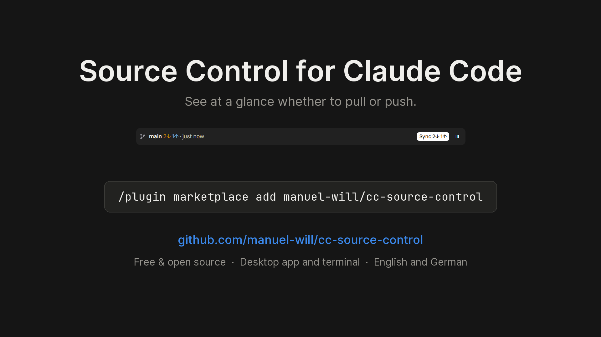
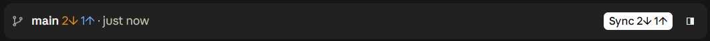
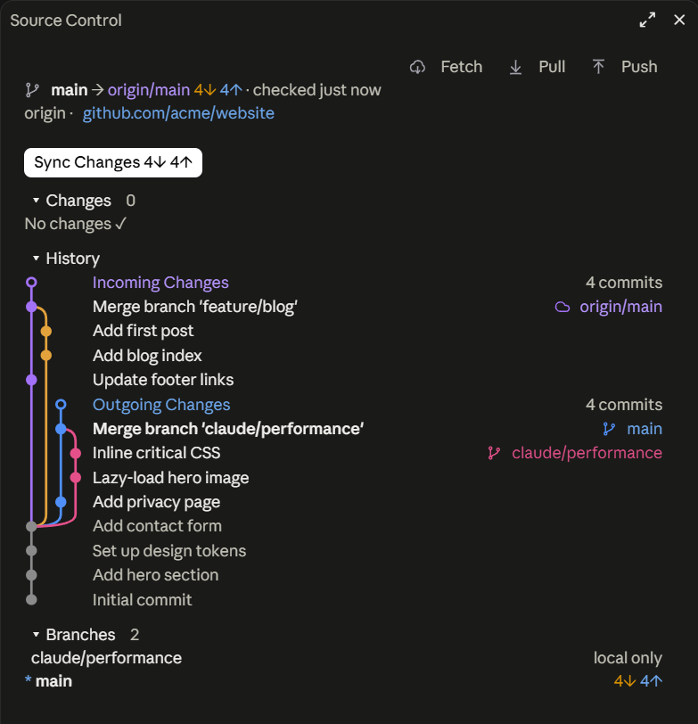
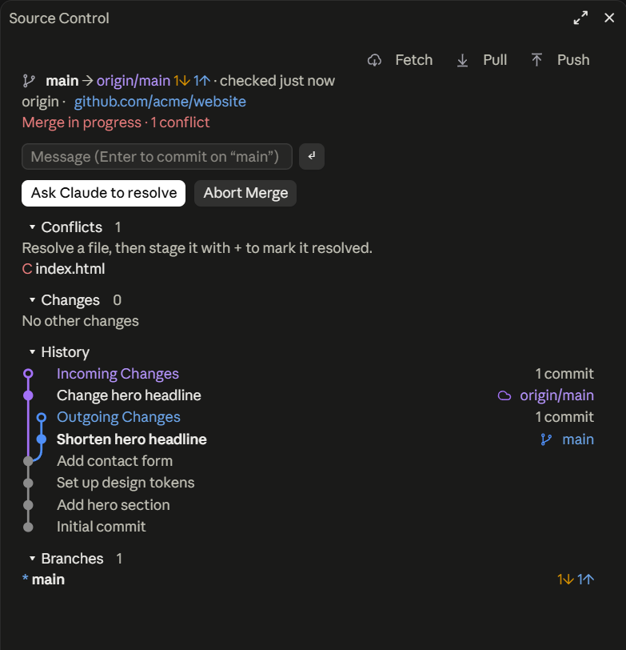

# Source Control für Claude Code

[English](README.md) · **Deutsch**

Eine Mod für Claude Code (Desktop-App und Terminal), die Git so sichtbar und bedienbar macht wie in VS Code.

[](https://github.com/manuel-will/cc-source-control/releases/download/v0.7.1/cc-source-control-launch.mp4)

**Leiste über der Chatbox**: immer da, minimal:



```
⎇ main 2↓ 1↑  ✎ 3 · vor 4 min                              [ ↻ Sync 2↓ 1↑ ]  ◨
```

- `⎇ main`: aktueller Branch (bzw. `abc1234 (detached)`)
- `2↓`: Commits auf dem Remote, die hier fehlen (**pullen**)
- `1↑`: lokale Commits, die noch nicht auf dem Remote sind (**pushen**)
- `✎ 3`: geänderte Dateien
- `vor 4 min`: wann zuletzt geprüft (gefetcht) wurde. **Gelb** heißt veraltet oder `offline`. Ein grünes `✓` erscheint nur, wenn alles sauber, synchron und frisch geprüft ist.
- Der **Haupt-Button** macht das, was gerade dran ist (wie in VS Code). In der Desktop-App ist er der Primär-Button der App, im Terminal VS-Code-blau:

  | Zustand | Button |
  |---|---|
  | hinter oder vor dem Remote | `↻ Sync` (Pull, dann Push) |
  | Branch ohne Upstream | `⇡ Veröffentlichen` |
  | nur lokale Änderungen | `✓ Commit…` (öffnet das Panel mit dem Nachrichtenfeld) |
  | Konflikt bzw. Merge/Rebase läuft | `Auflösen…` / `Abschließen…` (öffnet das Panel) |

- `◨` öffnet bzw. schließt das **Source-Control-Panel** rechts neben dem Chat.

**Panel „Source Control"** (rechts angedockt; in schmalen Terminals über dem Prompt):

<p>
  
  
</p>

```
Source Control                          ↻ Fetch  ↓ Pull  ↑ Push
⎇ main → origin/main 1↓ 1↑ · geprüft gerade eben
origin · github.com/manuel-will/cc-source-control
────────────────────────────────────────────────────────────────
Nachricht (Enter: Commit auf „main")
 ✓ Commit (alle 1)  [ ↻ Sync 1↓ 1↑ ]
▾ ÄNDERUNGEN 1                                           + alle
M app.js                                                     +
▾ VERLAUF
○ Eingehende Änderungen                                1 Commit
● PC: Readme                                     ⟨origin/main⟩
○ Ausgehende Änderungen                                1 Commit
● Laptop: Notizen erweitert                             ⟨main⟩
▾ BRANCHES 3 · ▾ WORKTREES 2 · ▾ STASHES 1
```

- **Commit:** Nachricht tippen und Enter drücken, oder den Haupt-Button nehmen. Ist nichts gestaged, werden alle Änderungen committet (Smart Commit wie in VS Code).
- **Stagen und Unstagen** pro Datei mit `+` bzw. `−`, oder alle auf einmal.
- **Verlauf** wie der Graph in VS Code: eingehende Commits lila, ausgehende blau, mit Pillen für `main` und `origin/main` in der Farbe ihrer Spur. Merges und Abzweigungen bekommen eigene farbige Spuren, die dort zusammenlaufen, wo sie sich trennten. Im Terminal sieht das aus wie bei `git log --graph`.
- **Branches** mit ↓/↑, `nur lokal` oder `auf Remote gelöscht`. Dazu **Worktrees** (auch die von Claude angelegten) mit ihren Änderungen und **Stashes**.
- **Konflikte** stehen in einem eigenen Abschnitt. Du löst die Datei und stagst sie dann mit `+`. Alternativ übergibt **„Claude: Konflikte lösen"** die Arbeit an Claude, und **„Merge abbrechen"** stellt den alten Stand wieder her.
- Würde ein Pull lokale Änderungen überschreiben, bietet das Panel **„Mit Autostash pullen"** an.

## Installation

Je einmal auf jedem Rechner (PC, Laptop), in Claude Code:

```
/plugin marketplace add manuel-will/cc-source-control
/plugin install source-control@cc-source-control
/reload-plugins
```

Oder im Terminal:

```
claude plugin marketplace add manuel-will/cc-source-control
claude plugin install source-control@cc-source-control --scope user
```

Mit `--scope user` ist die Mod in allen Projekten aktiv. Fragt Claude Desktop bei `/plugin install` nach dem Ort, „für alle Projekte“ (user) wählen. Geht `/git` nur in einem Ordner, ist die Mod nur dort installiert: `bash scripts/install-user.sh` installiert sie für alle Projekte. Fehlt `/git` in einzelnen Projekten trotzdem, zeigt `bash scripts/diagnose.sh` für jedes Projekt den Grund, z. B. `"disableAllHooks": true` in den Projekt-Einstellungen (Mods bestehen aus Hooks) oder ein dort abgeschaltetes Plugin. Die Meldung „4 userConfig options not yet set" bei der Installation ist unkritisch: Ohne eigene Werte gelten die Standardwerte (siehe Einstellungen). Erscheint die Mod nicht sofort, Claude Code bzw. die Desktop-App neu starten. Voraussetzung ist Claude Code 2.1.287 oder neuer.

**Update** nach einem Push in dieses Repo:

```
claude plugin marketplace update cc-source-control
claude plugin update source-control@cc-source-control
```

Danach Claude Code neu starten.

## Bedienung per Tastatur und Befehl

| Was | Wie |
|---|---|
| Panel öffnen (mit Fokus im Nachrichtenfeld) | `/git` oder `◨` |
| Leiste fokussieren (Terminal) | `ctrl+x tab`, dann `Tab` zwischen den Buttons, `Enter` drückt |
| Zurück zum Prompt | `Esc` |
| Panel schließen | `◨`, `ctrl+x x` oder erneut `/git`, wenn es den Fokus hat |
| Aktionen direkt | `/git sync`, `/git pull`, `/git push`, `/git fetch`, `/git publish` |
| Commit | `/git commit <Nachricht>` |
| Zusammenfassung | `/git status` |

## Einstellungen (`/config`)

| Option | Standard | Bedeutung |
|---|---|---|
| Fetch-Intervall (Minuten) | 10 | Hintergrund-`git fetch`, damit ↓ stimmt. 0 = aus |
| Status-Abfrage (Sekunden) | 30 | lokaler `git status` (ohne Netzwerk). Nach Claudes Befehlen wird sofort aufgefrischt |
| Veraltet nach (Stunden) | 12 | ab wann der letzte Fetch gelb markiert wird |
| Sprache | `auto` | `auto` folgt der Sprache von Claude Code, `en` oder `de` legt sie fest |

## Gut zu wissen

- **Hintergrund-Fetch:** beim Öffnen einer Session und dann alle 10 Minuten, ohne Passwortabfrage (`GIT_TERMINAL_PROMPT=0`, `GCM_INTERACTIVE=never`, SSH im Batch-Modus). Schlägt er fehl, steht in der Leiste `offline`. Mehrere Sessions im selben Repo fetchen nicht doppelt, weil die Mod auf `FETCH_HEAD` schaut.
- **Keine Lock-Konflikte:** Alle Lese-Befehle laufen mit `--no-optional-locks`.
- **Nur nicht-destruktive Aktionen:** kein Force-Push, kein Reset, kein Verwerfen von Änderungen. Pull verwendet `--no-rebase` (Merge wie in VS Code), außer du hast `pull.rebase` selbst konfiguriert.
- **Repo-Hooks laufen nicht**, wenn du aus der Mod committest oder pushst: Claude Code startet Git für Mods mit abgeschalteten Hooks. Hat das Repo Hooks (z. B. Husky), weist das Panel darauf hin. Brauchst du sie, lass Claude committen.
- **Zugangsdaten** in Remote-URLs werden nie angezeigt.
- **Nicht möglich:** eine Anzeige in der linken Projekt-Sidebar der Desktop-App. Die gehört zur App selbst, Mods können dort nicht zeichnen. Stattdessen gibt es die Leiste und das Panel.
- In der **Desktop-App** sind Buttons native App-Buttons. Der Haupt-Button nutzt dort die Primär-Optik der App, im Terminal das VS-Code-Blau.
- **Sprache:** Englisch oder Deutsch. Bei `auto` entscheidet zuerst die Einstellung `language` von Claude Code (z. B. `"language": "german"` in `~/.claude/settings.json`), dann die Locale (`LC_ALL`, `LC_MESSAGES`, `LANG`), dann die Sprache des Systems. Jede andere Sprache bekommt Englisch. Weitere Sprachen kommen als eigener Katalog in `source-control/hooks/i18n.ts` dazu.

## Lizenz

MIT, siehe [LICENSE](LICENSE).

## Entwicklung

```
cc-source-control/                ← Repo = Marketplace
├─ .claude-plugin/marketplace.json
└─ source-control/                ← die Mod
   ├─ .claude-plugin/plugin.json
   ├─ hooks/                      register.tsx, git.ts, parse.ts, snapshot.ts, actions.ts, ui/
   ├─ types/index.d.ts            Vertrag für $.state
   └─ tests/                      claude plugin test
```

- **Lokal ausprobieren:** `claude --plugin-dir ./source-control`. Gespeicherte Änderungen werden nachgeladen; falls nicht, die Session neu starten. Für die Desktop-App `CLAUDE_CODE_PLUGIN_DIRS` und `CLAUDE_CODE_PLUGIN_DIR_WATCH=1` im `env`-Block von `~/.claude/settings.json` setzen.
- **Spielwiese mit allen Zuständen:** `scripts/playground.sh` legt unter `~/sc-playground` ein Wegwerf-Repo an, mit eigenem Remote und einem zweiten Klon, der den anderen Rechner spielt. Öffne `~/sc-playground/work` einmal in Claude Code und lass die Session offen. Dann versetzt `scripts/playground.sh behind` (bzw. `ahead`, `diverged`, `conflict`, `overwrite`, `dirty`, `unpublished`, `stale`, `unfetched`, `offline`, `worktrees`, `detached`, `many`, `merges`, `clean`) das Repo in den jeweiligen Zustand, und `scripts/playground.sh tour` läuft alle nacheinander durch. Die Mod frischt spätestens nach 30 s auf, sofort mit `/git status`.
- **Prüfen:**
  ```
  claude plugin validate ./source-control
  claude plugin test ./source-control
  tsc -p source-control            # nachdem die Mod einmal geladen wurde
  ```
- `bash scripts/diagnose.sh` prüft für jedes Projekt, das Claude Code kennt, ob die Mod dort laden kann.
